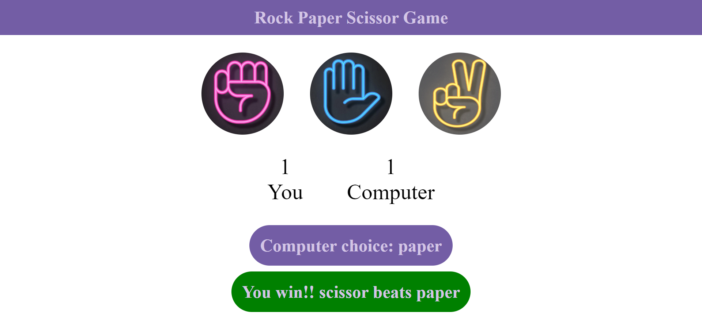
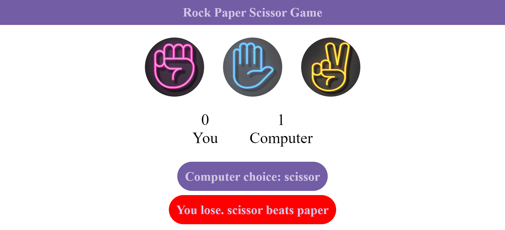

# Rock, Paper, Scissors Game

Welcome to the Rock, Paper, Scissors Game! 

## Description

A simple interactive Rock, Paper, Scissors game where a user plays against the computer. The game displays user and computer choices, keeps track of the score, and displays the game outcome for each round.

## Features

- User Choice: The user can select Rock, Paper, or Scissors.
- Computer Choice: The computer randomly selects Rock, Paper, or Scissors.
- Choices Display: Both the user's choice and the computer's choice are displayed after each round.
- Game Result: The game determines the result for each round:
    - Win: The user wins if their choice beats the computer's choice.
    - Lose: The user loses if the computer's choice beats the user's choice.
    - Draw: The game results in a draw if both the user and the computer make the same choice.
- Score Tracking: The user's and computer's scores are updated and displayed after each round.
    - User Score: The number of rounds the user has won.
    - Computer Score: The number of rounds the computer has won.

## How to Play
- Run the game.
- Choose one of the options: Rock, Paper, or Scissors.
- The computer will randomly choose its option.
- The game will display:
    - Your choice
    - The computer's choice
    - The result of the round (Win, Lose, or Draw)
    - Updated scores
- Continue playing to increase your score and beat the computer!

## Technologies Used

- **HTML**: For the structure of the website.
- **CSS**:For styling the application and enhancing user experience.
- **JavaScript**: For implementing the application logic.

## Screenshots

To provide a better understanding of the Recipe Book application, here is a screenshot:

##Main Interface

##Winner Interface

##Draw Interface

##Lose Interface

